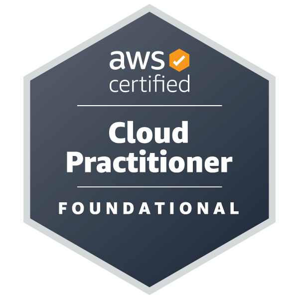
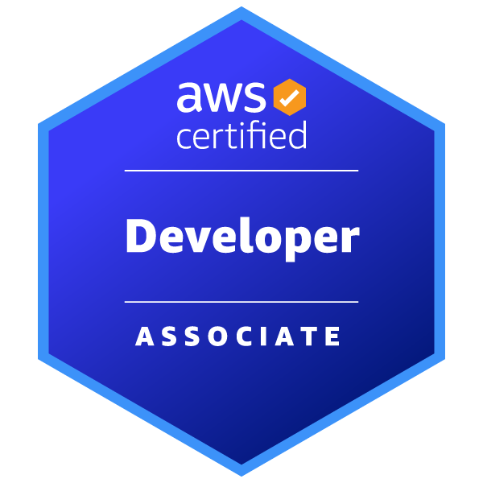

# Muito Prazer sou o Caio Passos 
Software Engineer | Python| Javascript | AWS Cloud Pratictioner | Aws Solutions Architect | Aws Developer Associate

### Sobre 
<strong>Bacharel da Area de Engenharia de Software</strong> e Apaixonado pela Tecnologia, gosto de <strong>desenvolver</strong> projetos e dar vida a ideias, este e meu perfil fique a vontade.

 

 
  
  

## 🎓 Certificações — AWS

  

  

  

## 🎓 Certificações — FIAP

  

  

  

  

  
  

# Redes Sociais

 
  
  
  
   
  

